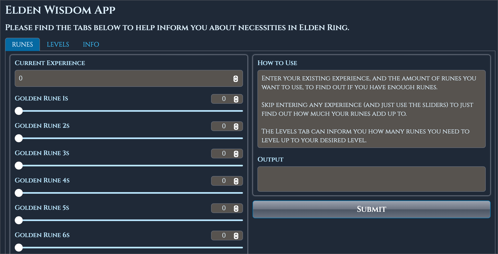
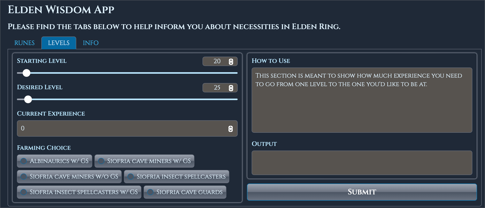

# Background
This is an app solely to help me calculate how many runes I need in Elden Ring, or how many enemies I need to expect to level up to my desired level.

## Usage
`docker run -d -p 5580:80 https://ghcr.io/packetpunter/eldenwisdom:latest` 
or build it locally and run with whatever tag you make

## Visualization

